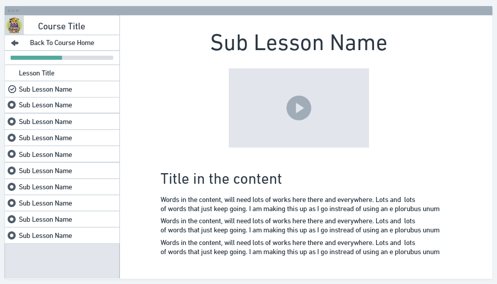

# Course Force

## About

This is a project to figure out how to create a course generator and play with some AI features

The first part of this app will just be the user course view

## Wireframes



## FSD Architecture

This project utilizes `Feature Sliced Design (FSD)` architecture

This approach organizes the project by functional areas (features) rather than solely by layers. This structure helps prevent unchecked growth in global directories (e.g., components or UI in modular architecture) and ensures a clear separation of responsibilities across components, modules, and layers.

* **Pages:** At the top level are the application's pages, representing the main views displayed to users.
* **Features/Widgets:** Below the pages are the core functional blocks (features or widgets) that define the page's primary functionality, ensuring they are manageable and self-contained.
* **Entities:** Beneath the feature modules are entities, constructed from reusable UI components provided by the "Shared" layer.
* **Shared:** The foundational layer contains shared UI components that can be utilized across various parts of the application.

Additional info can be found here: <https://feature-sliced.design/>

## Starting App Locally

First, run the development server:

```bash
npm run dev
# or
yarn dev
# or
pnpm dev
# or
bun dev
```

Open [http://localhost:3000](http://localhost:3000) with your browser to see the result.

This project uses [`next/font`](https://nextjs.org/docs/app/building-your-application/optimizing/fonts) to automatically optimize and load [Geist](https://vercel.com/font), a new font family for Vercel.

## Learn More

To learn more about Next.js, take a look at the following resources:

- [Next.js Documentation](https://nextjs.org/docs) - learn about Next.js features and API.
- [Learn Next.js](https://nextjs.org/learn) - an interactive Next.js tutorial.

You can check out [the Next.js GitHub repository](https://github.com/vercel/next.js) - your feedback and contributions are welcome!

## Deploy on Vercel

The easiest way to deploy your Next.js app is to use the [Vercel Platform](https://vercel.com/new?utm_medium=default-template&filter=next.js&utm_source=create-next-app&utm_campaign=create-next-app-readme) from the creators of Next.js.

Check out our [Next.js deployment documentation](https://nextjs.org/docs/app/building-your-application/deploying) for more details.
